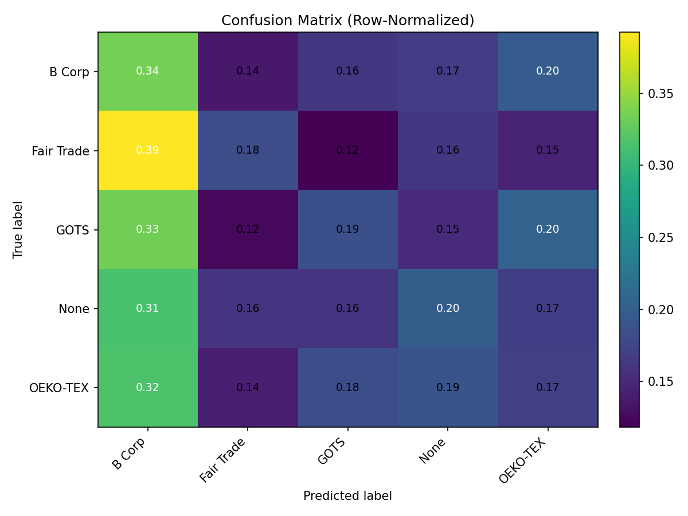

🌱 EcoHabit – AI-Powered Sustainable Lifestyle Tracker

EcoHabit is an intelligent system that helps individuals build eco-friendly habits by analyzing their daily lifestyle choices (transport, food, energy use) and recommending actions to reduce carbon footprint.

This repo contains the ML pipeline for training, evaluating, and predicting sustainable behavior trends using the sustainable_fashion_trends_2024.csv dataset.

🔑 Features

Data Preprocessing

Handles numeric, categorical, text, and datetime features

One-Hot Encoding (scikit-learn version-safe)

TF-IDF vectorization for text columns

Automatic date expansion (year, month, day, weekday)

Model Training

Keras deep learning model with dense layers

Supports both binary and multi-class targets

Saves model artifacts in multiple formats:

.h5 (full model)

.pkl (preprocessing bundle + label encoder)

.json & .yaml (model config)

Evaluation

Training curves (accuracy.png, loss.png)

Confusion matrix heatmaps (confusion_matrix.png, confusion_matrix_norm.png)

Classification report (precision/recall/F1)

Predictions saved as CSV

Prediction

CLI or Jupyter-safe predictor

Supports single text prediction (--text)

Supports batch CSV prediction (--in <file.csv>)

Exports results to predictions.csv

🛠️ Tech Stack

Python 3.11+

TensorFlow / Keras – model building

scikit-learn – preprocessing + evaluation

Matplotlib – graphs

Joblib – artifact saving/loading

📂 Project Structure
EcoHabit/
│── train_ecohabit.py              # Train model, save artifacts
│── evaluate_and_plot_ecohabit.py  # Generate accuracy/loss plots + heatmaps
│── predict_ecohabit.py            # Jupyter/CLI safe predictor
│── data/
│   └── sustainable_fashion_trends_2024.csv
│── outputs/
│   ├── mindpal_model.h5
│   ├── mindpal_model.json
│   ├── mindpal_model.yaml
│   ├── mindpal_preprocess.pkl
│   ├── training_history.csv
│   ├── accuracy.png
│   ├── loss.png
│   ├── confusion_matrix.png
│   ├── confusion_matrix_norm.png
│   ├── predictions.csv
│   └── classification_report.txt

🚀 How to Run
1. Train Model
python train_ecohabit.py

Artifacts will be saved into C:\Users\sagni\Downloads\Eco Habit.

2. Evaluate & Visualize
python evaluate_and_plot_ecohabit.py

Generates accuracy/loss plots and confusion matrix heatmaps.

3. Predict

Single text input

python predict_ecohabit.py --text "I used the metro today" --print

Batch CSV prediction

python predict_ecohabit.py --in data/new_data.csv --out outputs/predictions.csv --print

In Jupyter Notebook

from predict_ecohabit import predict_text, predict_csv

# Single sentence
predict_text("I cycled to work instead of driving.", show=True)

# Whole CSV
predict_csv("data/new_data.csv", save_to="outputs/predictions.csv", show=True)

📊 Example Output
Prediction (CSV)
pred_label	prob_pos	prob_neg	commute	food_choice
eco	0.82	0.18	metro	vegetarian
non-eco	0.27	0.73	car	fast food
Confusion Matrix Heatmap

confusion_matrix.png (counts)

confusion_matrix_norm.png (row-normalized)

🎯 Why EcoHabit?

Most ML projects focus on prediction or classification tasks in external domains.
EcoHabit is different: it’s about self-improvement and sustainability, merging behavioral analytics + NLP + gamification to promote greener lifestyles.

📌 Next Steps

Add leaderboard & gamification API
Author
Sagnik Patra

Connect to Google Fit / IoT energy sensors

Deploy model as REST API or mobile app backend
